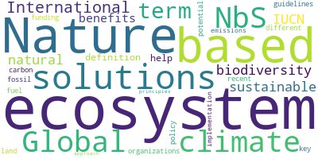

# Approach
## Extraction of commonly used terms in the GYBN policy briefs
- Use PyPDF2 library to extract text from .pdf file
- Create a dictionary with counter for each identified word
- Filter common stop-words (based on context)

## Evaluation of the terms to identify meaning
- Load data into Dataframe
- Visualize wordcloud from Dataframe, learnt from this [Datacamp tutorial](https://www.datacamp.com/community/tutorials/wordcloud-python)

## Output

